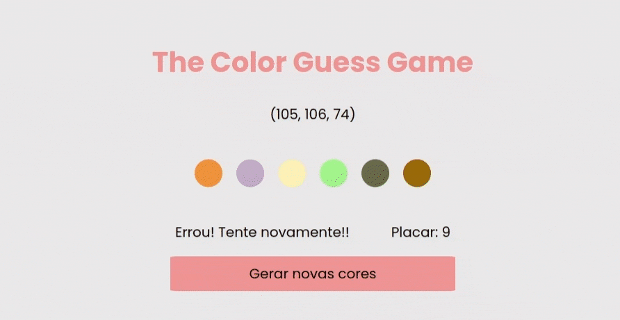

# Color Guess Game !

The idea with this project is to create a game where the user must guess which color is correct based on a randomly generated RGB.

It was developed using HTML, CSS and JavaScript and has as a study goal, to understand how to manipulate the DOM using JavaScript.

 

 

# Technologies Used

For this project the following technologies were used:

- [JavaScript](https://developer.mozilla.org/pt-BR/docs/Web/JavaScript)
- [CSS](https://developer.mozilla.org/pt-BR/docs/Web/CSS)
- [Docker](https://www.docker.com/)

## How to Use:

1. Clone the repository

  ~~~bash
  git clone git@github.com:JeffThierch/Color-Guess-Game.git
  ~~~

2. In the root of the project change the .env_example file to .env

3. (Optional) - Change the environment variables.

4. In the root of project run the commands:

  ~~~bash
  docker-compose up --build
  ~~~

5. If everything is configured correctly, after the build process you can simply access the application.
